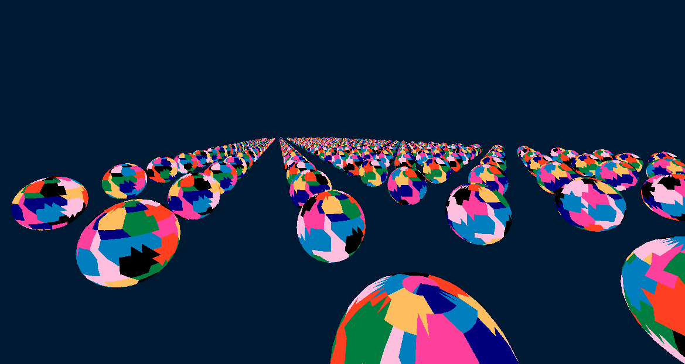

# **Mesh Shader - DirectX 12**

## Summary
- [About the project](#about-the-project)
- [Features](#features)
- [Content](#content)
- [In the future](#in-the-future)
- [References](#references)
- [Credit](#credit)

# About the project
This project is a showcase of different rendering techniques using Mesh Shader.

# Features
* Mesh Shader Implementation
* Meshlet generation
* Amplification Shader Implementation
* Meshlet highlighting 
* Instancing
* Frustum Culling
    * Frustum sphere culling
    * Frustum cone culling
    * Frustum plane culling

# Controls
You can change the different defines at the top of `mainDX12.cpp` and `MeshLitShader.hlsl` to modify the rendering features, these defines must be coherent through the two files (inconsistent definition may occur a crash):
* `USE_MESHSHADER` defines if the mesh shader pipeline is used
* `USE_AMPLIFICATIONSHADER` defines if amplification is added to the mesh shader pipeline (required for instancing and culling).
* `AS_GROUPSIZE` defines the number of amplification shader threads (modify it at your own risk).
* `DISPLAY_VERTEX_COLOR_ONLY` defines if the meshlets are colored through their pixel shader (based on PBR rendering by default).
* `USE_MESHLET_ID_AS_VERTEX_COLOR` defines if the meshlets are colored using their own id (which is static).
* `USE_MESH_SHADER_GROUP_ID_AS_VERTEX_COLOR` defines if the meshlets are colored using their dispatched groupe id (which is dependent to the culling).
* `USE_INSTANCING` defines if instancing is used.
* `USE_CULLING` defines if culling will be applied.
* `USE_FRUSTUM_CONE_CULLING` defines if the frustum culling is based on cone culling (a cone wraps virtually the frustum of the camera).
* `USE_FRUSTUM_ALL_PLANES_CULLING` defines if the frustum culling is based on 6 planes culling. 
* `USE_FRUSTUM_SPHERE_CULLING` defines if the frustum culling is based on sphere culling (a sphere wraps virtually the frustum of the camera). 
* `USE_FRUSTUM_SINGLE_PLANE_CULLING` defines which plane should culls the meshlets (possible values are `FRUSTUM_PLANE_LEFT`, `FRUSTUM_PLANE_RIGHT`, `FRUSTUM_PLANE_TOP`, `FRUSTUM_PLANE_BOTTOM`, `FRUSTUM_PLANE_NEAR`, `FRUSTUM_PLANE_FAR`).

The default defined macros are: `USE_MESHSHADER`, `USE_AMPLIFICATIONSHADER`, `AS_GROUP_SIZE 32`, `USE_INSTANCING`, `USE_CULLING`, `DISPLAY_VERTEX_COLOR_ONLY`, `USE_MESH_SHADER_GROUP_ID_AS_VERTEX_COLOR`, `USE_FRUSTUM_SINGLE_PLANE_CULLING FRUSTUM_PLANE_NEAR`, `USE_FRUSTUM_CONE_CULLING`

# Content

## Mesh Shader compilation
The compilation uses DXC (DirectXShaderCompiler) at build time because of the Shader Model 6 is not supported by the default DirectX 12 compiler.

## Meshlets generation
The meshlets generation is based on zeux's meshoptimizer.

## Instancing 

*Instancing of meshes using a PBR material.*

The instancing is a basic instancing implementation, except that it is based on dispatching multiple times the Mesh Shader by the Amplification Shader.

# Frustum Culling

*Instancing and Plane Frustum Culling showing the GroupID of the meshlets changing because of the discarded meshlets on the edges of the frustum.*

*Sphere Frustum Culling using the frustum of the camera.*

The Frustum Culling supports three different techniques:
* Plane culling
* Cone culling
* Sphere culling

The very first step is to retrieve the meshlet bounds using meshoptimizer, then to apply multiple culling algorithm.

Then the different primitives (planes, sphere and cone) used for the culling must be computed on the CPU using the view-projection matrix of the camera (which is the mathematical representation of the frustum).

The mathematical representation of the primitives must then be sent to the GPU to be used by the Mesh Shader.

The plane culling discards meshlets based on their signed distance from each plane of the frustum and their intersection from each plane. If for each planes the signed distance between the center of meshlet and the plane is positive, then the meshlet is in the frustum. This simple condition is not sufficient, because if the center of meshlet is outside the plane but its bounds pass through the plane then the meshlet must be displayed. To fix this issue, the Minkowski addition can be used to take the bounds (which are represented by a sphere) of the meshlet in account.

The sphere and the cone culling are based on the general formulae of the intersection between the primitive.

The final implementation uses the intersection of the two sets retrieved by the plane culling of the near plane and the cone culling of the frustum.

# In the future
In the future, this project will be implemented on Vulkan and will support LOD selection.

# References
- https://github.com/microsoft/DirectXShaderCompiler
- https://github.com/zeux/meshoptimizer
- https://learn.microsoft.com/en-us/samples/microsoft/directx-graphics-samples/d3d12-mesh-shader-samples-win32/
- https://chaoticbob.github.io/2023/12/09/d3d12-mesh-shader.html

# Credit
- Rémi GINER
